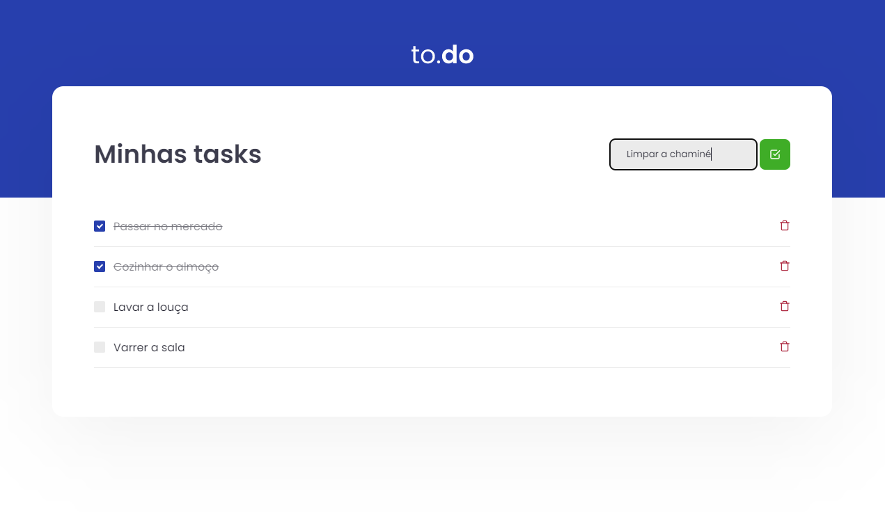

<h1 align="center" id="#BannerTo.Do">
  
</h1>

<h2 id="#sobre-o-projeto">Sobre o projeto</h2>

É uma pequena aplicação de <em>atividades pra fazer</em> baseada em um template da Rocketseat com o fim de treinar conceitos base do React, principalmente a manipulação de estado.